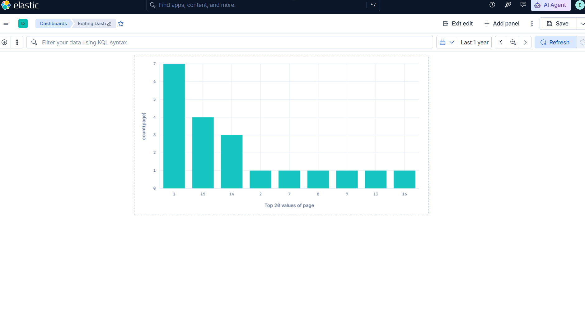
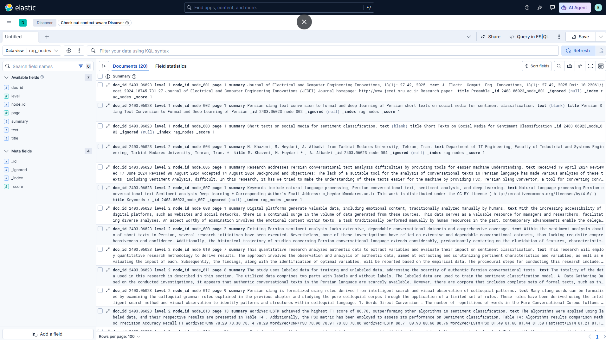

# DIY PageIndex-style Vectorless RAG

A lightweight, reasoning-first RAG pipeline inspired by [PageIndex](https://pageindex.ai) — built from scratch with **no vector database**, **no chunking**, and **no external retrieval API**.

Instead of splitting documents into fixed chunks and searching an embedding space, this project:
1. Parses a PDF into a **hierarchical section tree**
2. Uses an **LLM to reason over the tree** and select relevant nodes
3. Extracts text from those nodes and generates a **grounded, traceable answer**



---

## How It Works

```
- PDF
- pymupdf extracts headings + text
- LLM summarizes each section (one sentence)
- LLM reasons over the tree → picks relevant node IDs
- Text from selected nodes → LLM generates final answer
```

No embeddings. No cosine similarity. No top-K lookup.
Just structured document understanding + LLM reasoning.

---

## Quickstart

**1. Clone the repo**
```bash
git clone https://github.com/MohammadHeydari/PageIndexRAG.git
cd diy-pageindex-rag
```

**2. Install dependencies**
```bash
pip install pymupdf openai requests
```

**3. Set your API key**
```bash
export GAPGPT_API_KEY="your_key_here"
```

**4. Run**
```bash
python pageindex_.py
```

---

## Configuration

Open `pageindex_.py` and edit the config section at the top:

```python
GAPGPT_API_KEY  = os.getenv("GAPGPT_API_KEY", "your_key_here")
GAPGPT_MODEL    = "gapgpt-qwen-3.5"   # or: gapgpt-gpt-4o

PDF_URL = "https://arxiv.org/pdf/2403.06023.pdf"  # or a local path: "./my_doc.pdf"
QUERY   = "What are the main conclusions of this document?"
```

This project uses [GapGPT](https://gapgpt.app) as the LLM provider (OpenAI-compatible API).
You can swap it for any OpenAI-compatible endpoint by changing `GAPGPT_BASE_URL` and `GAPGPT_MODEL`.

---

## Example Output

```

  DIY PageIndex-style Vectorless RAG

Extracting Document Structure
   20 Sections Found

Creating Summary for 20 Sections ...

Searching ...

LLM Reasoning:
The question asks for the main conclusions. Node [node_014] is
explicitly titled 'Conclusion'. Node [node_013] 'Results and
Discussion' contains the key quantitative findings.

Selected Nodes: ['node_013', 'node_014']


Final Response

1. PSC method improved deep learning classifier performance.
2. Best accuracy: 81.91% (FastText + LSTM + PSC).
3. BERT underperformed due to domain mismatch with informal text.

Used nodes: node_013, node_014


Results stored in rag_result.json
```

---

## Output File

Results are saved to `rag_result.json`:

```json
{
  "pdf": "https://...",
  "query": "What are the main conclusions?",
  "selected_nodes": ["node_013", "node_014"],
  "answer": "...",
  "tree_summary": [
    { "id": "node_013", "title": "Results and Discussion", "page": 5, "summary": "..." },
    { "id": "node_014", "title": "Conclusion", "page": 6, "summary": "..." }
  ]
}
```

---


## Elasticsearch + Kibana Integration

This project includes a hybrid search extension (`pageindex_es.py`) that connects to a local Elasticsearch instance.

**How it works:**

```
Query
  └─► Elasticsearch full-text search → top 10 candidate nodes
            └─► LLM reasons over candidates → selects 2-3 final nodes
                      └─► Text from selected nodes → final answer
```

The document tree is indexed once on first run. Every subsequent query skips PDF parsing and goes straight to Elasticsearch — making repeated queries significantly faster.

**Setup:**

1. Install and run Elasticsearch locally (tested with v9.4.2)
2. Create a `.env` file:
```
GAPGPT_API_KEY=your_key
ES_PASSWORD=your_elastic_password
```
3. Install dependencies and run:
```bash
pip install elasticsearch python-dotenv
python pageindex_es.py
```

**Kibana Dashboard:**

The indexed nodes (`rag_nodes`) can be explored visually in Kibana:
- Connect Kibana to the same Elasticsearch instance
- Create a Data View for the `rag_nodes` index
- Use Discover to search and filter nodes by title, summary, or page
- Build visualizations — for example, a bar chart showing node distribution across pages

---


## Requirements

- Python 3.10+
- `pymupdf` — PDF parsing
- `openai` — LLM calls (OpenAI-compatible)
- `requests` — PDF download
